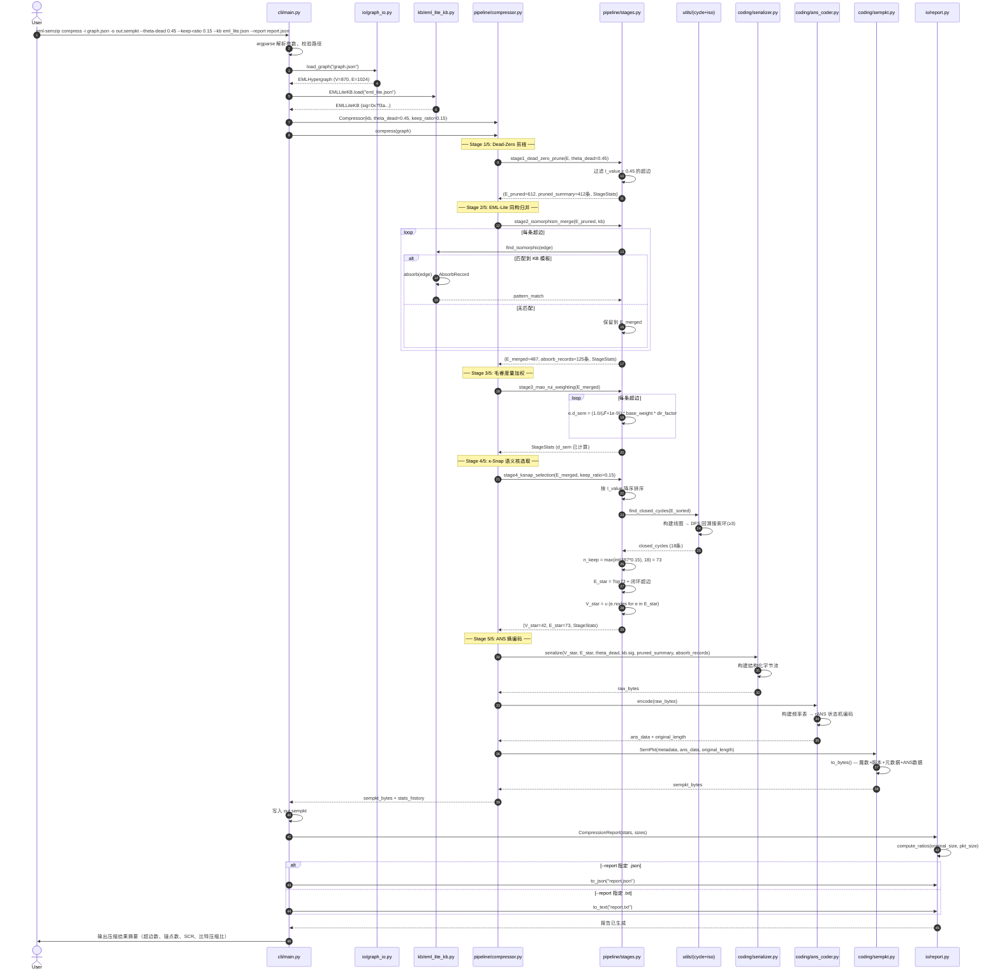
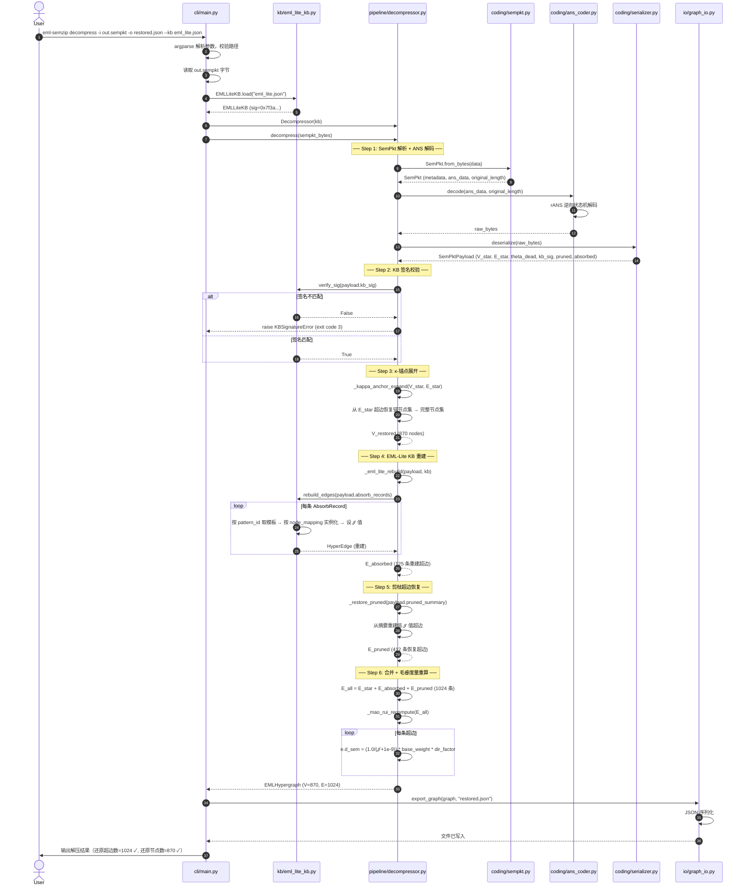
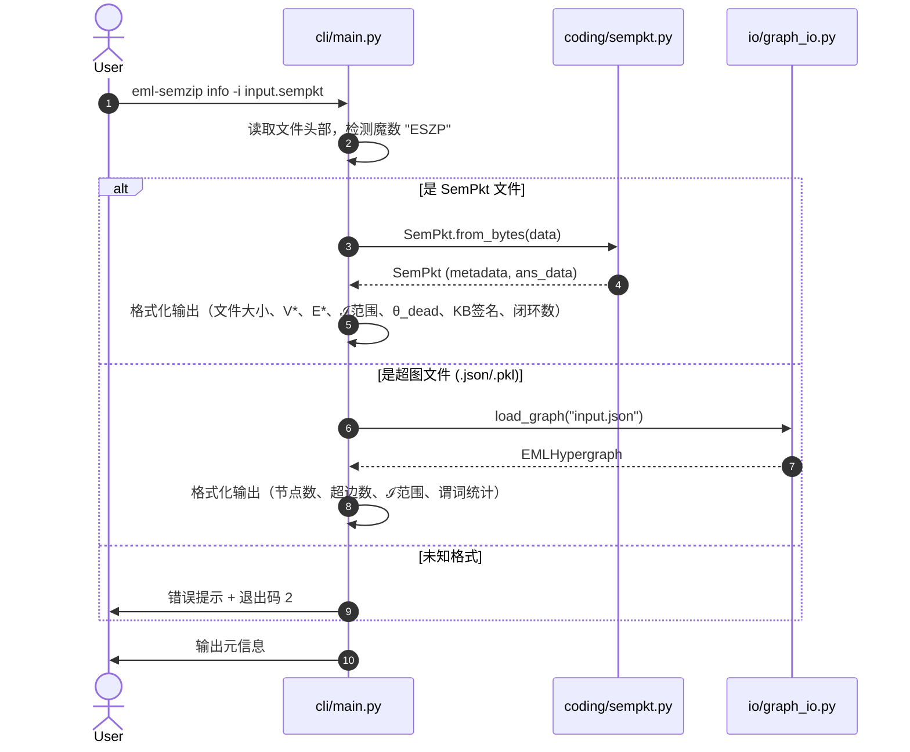
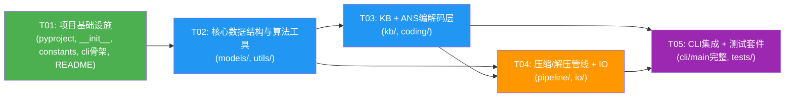

# 架构设计文档 — EML-SemZip 语义压缩解压软件

> **项目名**: `eml_semzip`  
> **语言**: Python 3.13（纯标准库，零外部依赖）  
> **架构师**: 高见远（Bob）  
> **版本**: v1.0  
> **日期**: 2026-06-18  

---

## 目录

- [Part A: 系统设计](#part-a-系统设计)
  - [1. 实现方案与框架选型](#1-实现方案与框架选型)
  - [2. 文件列表](#2-文件列表)
  - [3. 数据结构与接口（类图）](#3-数据结构与接口类图)
  - [4. 程序调用流程（时序图）](#4-程序调用流程时序图)
  - [5. 待明确事项](#5-待明确事项)
- [Part B: 任务分解](#part-b-任务分解)
  - [6. 依赖包列表](#6-依赖包列表)
  - [7. 任务列表](#7-任务列表)
  - [8. 共享知识](#8-共享知识跨文件约定)
  - [9. 任务依赖图](#9-任务依赖图)

---

## Part A: 系统设计

### 1. 实现方案与框架选型

#### 1.1 总体架构

EML-SemZip 采用**分层管道架构**（Layered Pipeline Architecture），自底向上分为五层：

```
┌─────────────────────────────────────────────────────┐
│                    CLI 层 (cli/)                     │
│         argparse 子命令分发 · 用户交互 · 报告输出       │
├─────────────────────────────────────────────────────┤
│                 管线编排层 (pipeline/)                 │
│      Compressor(五阶段正向) · Decompressor(逆向)       │
├──────────────┬──────────────┬───────────────────────┤
│  编解码层     │   IO 层       │    知识库层 (kb/)      │
│ (coding/)    │  (io/)        │  EMLLiteKB · 内置KB   │
│ ANS·序列化    │ JSON·Pickle   │  同构查找·吸收·签名    │
│ SemPkt格式    │ 报告生成       │                       │
├──────────────┴──────────────┴───────────────────────┤
│              数据模型层 (models/) + 算法工具 (utils/)    │
│        Node · HyperEdge · EMLHypergraph              │
│        闭环检测 · 同构匹配                              │
├─────────────────────────────────────────────────────┤
│              基础设施层 (constants · __init__)          │
└─────────────────────────────────────────────────────┘
```

**设计原则**：
- **单向依赖**：上层依赖下层，下层不感知上层。CLI → Pipeline → {Coding, IO, KB} → {Models, Utils} → Constants
- **纯标准库**：所有功能仅使用 Python 3.13 标准库（`argparse`、`json`、`pickle`、`struct`、`hashlib`、`collections`、`dataclasses`、`pathlib`、`io`、`sys`、`os`、`typing`），零外部依赖
- **管道可组合**：五个压缩阶段为独立函数，可单独测试和替换；解压为逆向管道
- **可审计性**：每个阶段输出 `StageStats` 统计对象，管线全程记录变换轨迹

#### 1.2 核心技术挑战与解决方案

| 挑战 | 解决方案 |
|------|----------|
| **ANS 熵编码自实现** | 基于 rANS（range Asymmetric Numeral Systems）变体实现字节级熵编码。编码器构建字节频率表 → 归一化 → rANS 状态机编码；解码器逆向操作。使用 `struct` 打包状态，`collections.Counter` 统计频率 |
| **超图同构匹配** | 采用**规范化签名**策略：对超边按 `(predicate, frozenset(node_attributes_types), len(nodes))` 生成规范键，KB 中用字典索引实现 O(1) 查找。匹配时验证节点属性结构兼容性 |
| **闭环检测（≥3节点）** | 构建超图的**线图**（line graph）：每条超边为节点，共享节点的超边间连边。在线图上执行 DFS 回溯搜索长度 ≥3 的环。使用 `utils/cycle_detection.py` 独立实现 |
| **无损语义还原** | 压缩时，被 KB 吸收的超边记录**吸收引用**（pattern_id + 节点映射 + ℐ值），被剪枝的超边记录**剪枝摘要**（节点集 + ℐ值 + predicate）。两者序列化进 SemPkt，解压时从引用和摘要重建 |
| **SemPkt 二进制格式** | 自定义紧凑二进制格式：魔数(4B) + 版本(1B) + 元数据长度(4B) + 元数据(JSON) + ANS编码数据长度(4B) + ANS数据。使用 `struct` 模块打包 |
| **大超图性能** | 闭环检测使用访问标记避免重复遍历；同构匹配用字典索引避免全量扫描；κ-Snap 选取用 `sorted()` + 切片，O(n log n) |

#### 1.3 框架与库选型

| 类别 | 选型 | 理由 |
|------|------|------|
| **CLI 框架** | `argparse`（标准库） | 纯标准库约束下唯一选择；支持子命令、参数校验、自动帮助生成 |
| **序列化** | `json` + `pickle`（标准库） | JSON 主格式（可读、可调试）；Pickle 备选（高效、支持复杂对象）。SemPkt 内部用 JSON 序列化元数据 + 自定义二进制序列化语义核 |
| **数据类** | `@dataclass` + `typing`（标准库） | Python 3.13 dataclass 提供简洁的数据结构定义；typing 提供类型注解增强可读性 |
| **哈希/签名** | `hashlib`（标准库） | SHA-256 生成 KB 签名，确保解压时 KB 兼容性校验 |
| **二进制打包** | `struct`（标准库） | SemPkt 头部定长字段打包/解包 |
| **测试框架** | `unittest`（标准库） | 纯标准库约束下选择；支持 fixture、断言、测试发现 |

---

### 2. 文件列表

```
eml_semzip/
├── __init__.py                         # 包初始化，版本号，公共导出
├── constants.py                        # 默认参数常量（theta_dead, keep_ratio, 魔数等）
│
├── models/
│   ├── __init__.py                     # 模型层导出
│   ├── node.py                         # Node 数据类
│   ├── hyperedge.py                    # HyperEdge 数据类（含 d_sem 计算属性）
│   └── hypergraph.py                   # EMLHypergraph 超图类（CRUD + JSON/Pickle IO）
│
├── kb/
│   ├── __init__.py                     # KB 层导出
│   ├── eml_lite_kb.py                  # EMLLiteKB 类（find_isomorphic, absorb, sig, 持久化）
│   └── builtin_kb.py                   # 内置示例 KB + 空白 KB 工厂函数
│
├── pipeline/
│   ├── __init__.py                     # 管线层导出
│   ├── stages.py                       # 五阶段独立函数 + StageStats 统计类
│   ├── compressor.py                   # Compressor 类（编排五阶段正向管线）
│   └── decompressor.py                 # Decompressor 类（逆向解压管线）
│
├── coding/
│   ├── __init__.py                     # 编解码层导出
│   ├── ans_coder.py                    # ANSCoder 类（rANS 字节级熵编码/解码）
│   ├── serializer.py                   # Serializer 类（语义核 ↔ 字节流双向转换）
│   └── sempkt.py                       # SemPkt 数据类 + 二进制格式读写
│
├── io/
│   ├── __init__.py                     # IO 层导出
│   ├── graph_io.py                     # 超图 JSON/Pickle 加载与导出
│   └── report.py                       # CompressionReport 类（SCR 统计 + 文本/JSON 输出）
│
├── utils/
│   ├── __init__.py                     # 工具层导出
│   ├── cycle_detection.py              # DFS 闭环检测（线图 + 回溯搜索）
│   └── isomorphism.py                  # 超边同构匹配（规范化签名 + 字典索引）
│
└── cli/
    ├── __init__.py                     # CLI 层导出
    └── main.py                         # CLI 入口（argparse 子命令：compress/decompress/info）

tests/
├── __init__.py
├── test_models.py                      # 数据结构单元测试
├── test_kb.py                          # KB 管理单元测试
├── test_pipeline.py                    # 压缩/解压管线集成测试（含可逆性验证）
├── test_coding.py                      # ANS 编解码 + 序列化可逆性测试
├── test_cli.py                         # CLI 端到端测试
└── fixtures/
    ├── sample_graph.json               # 示例超图（含闭环结构）
    └── example_kb.json                 # 示例 EML-Lite KB

pyproject.toml                          # 项目配置（构建、入口点、元数据）
README.md                               # 项目说明（安装、用法、架构概述）
```

**文件统计**：源文件 21 个 + 测试文件 7 个 + 配置/文档 2 个 = **30 个文件**

---

### 3. 数据结构与接口（类图）

```mermaid
classDiagram
    direction TB

    %% ─── 数据模型层 ───
    class Node {
        +str node_id
        +dict attributes
        __init__(node_id: str, attributes: dict~str, Any~) None
        +to_dict() dict
        +from_dict(d: dict) Node
    }

    class HyperEdge {
        +str edge_id
        +set~str~ nodes
        +float I_value
        +float base_weight
        +float dir_factor
        +str predicate
        +float d_sem
        __init__(edge_id, nodes, I_value, predicate, base_weight, dir_factor) None
        +compute_d_sem() float
        +canonical_key() tuple
        +to_dict() dict
        +from_dict(d: dict) HyperEdge
    }

    class EMLHypergraph {
        +dict~str, Node~ V
        +list~HyperEdge~ E
        __init__() None
        +add_node(node: Node) None
        +add_edge(edge: HyperEdge) None
        +remove_edge(edge_id: str) bool
        +get_edges_by_node(node_id: str) list~HyperEdge~
        +get_nodes() set~str~
        +to_json(path: str) None
        +from_json(path: str) EMLHypergraph
        +to_pickle(path: str) None
        +from_pickle(path: str) EMLHypergraph
        +edge_count() int
        +node_count() int
    }

    %% ─── 知识库层 ───
    class EMLLiteKB {
        +list~HyperEdge~ patterns
        +dict~tuple, list~index~
        +str sig
        +dict~str, list~ absorbed_records
        __init__() None
        +find_isomorphic(edge: HyperEdge) HyperEdge
        +absorb(edge: HyperEdge) AbsorbRecord
        +compute_sig() str
        +verify_sig(expected: str) bool
        +save(path: str) None
        +load(path: str) EMLLiteKB
        +add_pattern(edge: HyperEdge) None
        +rebuild_edges(records: list~AbsorbRecord~) list~HyperEdge~
    }

    class AbsorbRecord {
        +str pattern_id
        +dict~str, str~ node_mapping
        +float I_value
        +float base_weight
        +float dir_factor
        +str predicate
        __init__(...) None
        +to_dict() dict
        +from_dict(d: dict) AbsorbRecord
    }

    %% ─── 编解码层 ───
    class ANSCoder {
        __init__() None
        +encode(data: bytes) bytes
        +decode(data: bytes, original_length: int) bytes
        -_build_freq_table(data: bytes) list~int~
        -_normalize_freqs(freqs: list~int~) tuple
    }

    class Serializer {
        __init__() None
        +serialize(V_star: set~str~, E_star: list~HyperEdge~, theta_dead: float, kb_sig: str, pruned_summary: list, absorb_records: list) bytes
        +deserialize(data: bytes) SemPktPayload
    }

    class SemPkt {
        +bytes magic
        +int version
        +dict metadata
        +bytes ans_data
        +int original_length
        __init__(metadata, ans_data, original_length) None
        +to_bytes() bytes
        +from_bytes(data: bytes) SemPkt
        +is_valid() bool
    }

    class SemPktPayload {
        +set~str~ V_star
        +list~HyperEdge~ E_star
        +float theta_dead
        +str kb_sig
        +list pruned_summary
        +list~AbsorbRecord~ absorb_records
    }

    %% ─── 管线层 ───
    class StageStats {
        +str stage_name
        +int edges_before
        +int edges_after
        +dict details
        __init__(stage_name, edges_before, edges_after, details) None
        +to_dict() dict
    }

    class Compressor {
        +EMLLiteKB kb
        +float theta_dead
        +float keep_ratio
        +list~StageStats~ stats_history
        __init__(kb, theta_dead, keep_ratio) None
        +compress(graph: EMLHypergraph) bytes
        -_stage1_dead_zero_prune(E: list) tuple~list, list, StageStats~
        -_stage2_isomorphism_merge(E: list, kb: EMLLiteKB) tuple~list, list, StageStats~
        -_stage3_mao_rui_weighting(E: list) StageStats
        -_stage4_ksnap_selection(E: list, keep_ratio: float) tuple~set, list, StageStats~
        -_stage5_ans_encode(V_star, E_star, theta_dead, kb_sig, pruned, absorbed) bytes
        +get_report() CompressionReport
    }

    class Decompressor {
        +EMLLiteKB kb
        __init__(kb) None
        +decompress(sempkt_bytes: bytes) EMLHypergraph
        -_ans_decode(data: bytes) SemPktPayload
        -_kappa_anchor_expand(V_star, E_star) set~str~
        -_eml_lite_rebuild(payload: SemPktPayload, kb: EMLLiteKB) list~HyperEdge~
        -_mao_rui_recompute(E: list) None
        -_restore_pruned(pruned_summary: list) list~HyperEdge~
    }

    %% ─── IO 层 ───
    class CompressionReport {
        +int original_edges
        +int anchor_edges
        +int original_nodes
        +int anchor_nodes
        +float theta_dead
        +float keep_ratio
        +list~StageStats~ stages
        +str kb_sig
        +float scr_anchor
        +float scr_info
        +float bit_ratio
        +dict d_sem_audit
        __init__(...) None
        +compute_ratios(original_size: int, pkt_size: int) None
        +to_json(path: str) None
        +to_text(path: str) None
        +to_dict() dict
    }

    %% ─── 关系 ───
    EMLHypergraph "1" *-- "many" Node : contains V
    EMLHypergraph "1" *-- "many" HyperEdge : contains E
    HyperEdge --> Node : references by node_id

    EMLLiteKB "1" *-- "many" HyperEdge : pattern templates
    EMLLiteKB "1" *-- "many" AbsorbRecord : absorbed records

    Compressor --> EMLHypergraph : compresses
    Compressor --> EMLLiteKB : uses for merge
    Compressor --> ANSCoder : delegates encoding
    Compressor --> Serializer : delegates serialization
    Compressor --> SemPkt : produces
    Compressor "1" *-- "many" StageStats : records

    Decompressor --> SemPkt : consumes
    Decompressor --> EMLLiteKB : uses for rebuild
    Decompressor --> ANSCoder : delegates decoding
    Decompressor --> Serializer : delegates deserialization
    Decompressor --> EMLHypergraph : produces

    Serializer --> SemPktPayload : creates
    SemPkt --> SemPktPayload : wraps payload
    CompressionReport "1" *-- "many" StageStats : aggregates
```



<details>
<summary>📖 类图说明（点击展开）</summary>

**核心关系解释**：

1. **EMLHypergraph** 聚合 Node 和 HyperEdge，是整个系统的核心数据载体
2. **EMLLiteKB** 持有 HyperEdge 模板列表和 AbsorbRecord 吸收记录，提供同构查找与吸收合并
3. **Compressor** 编排五阶段管线，内部委托 ANSCoder 和 Serializer 完成最终编码
4. **Decompressor** 逆向执行：ANS 解码 → 反序列化 → κ-锚点展开 → KB 重建 → 毛睿重算
5. **SemPkt** 是压缩产物，封装元数据 + ANS 编码数据
6. **StageStats** 贯穿管线全程，被 CompressionReport 聚合为最终报告
7. **AbsorbRecord** 记录被 KB 吸收的超边信息，解压时用于重建

</details>

---

### 4. 程序调用流程（时序图）

#### 4.1 压缩流程



#### 4.2 解压流程



#### 4.3 info 子命令流程



---

### 5. 待明确事项

| # | 事项 | 当前假设 | 影响 |
|---|------|----------|------|
| A1 | **剪枝超边的无损恢复**：PRD 伪码仅序列化 V*, E*, theta_dead, kb.sig，但 P0-3 要求"还原后超边数与压缩前一致"。当前设计在 SemPkt 中额外存储 `pruned_summary`（剪枝超边摘要）和 `absorb_records`（KB 吸收记录）以支持完整重建。 | 扩展 serialize 参数，增加 pruned_summary 和 absorb_records | coding/serializer.py, pipeline/compressor.py |
| A2 | **ANS 编码的频率模型**：采用静态字节频率模型（编码前统计全部字节频率，频率表存入 SemPkt 元数据）。未实现自适应/上下文模型。 | 静态频率表，存入 metadata | coding/ans_coder.py |
| A3 | **同构匹配的粒度**：当前实现为超边级同构（predicate + 节点数 + 属性结构类型匹配），非子图级同构。对于复杂拓扑可能需要扩展。 | 超边级同构，后续可扩展为子图级 | utils/isomorphism.py, kb/eml_lite_kb.py |
| A4 | **闭环检测的性能**：DFS 回溯在最坏情况下为 O(2^E)，当前对 E > 1000 的大超图可能较慢。可通过设置最大搜索深度或改用 union-find 优化。 | DFS + 最大深度限制 (max_depth=100) | utils/cycle_detection.py |
| A5 | **KB 签名算法**：使用 SHA-256 对所有 KB pattern 的规范化签名排序后拼接取哈希。KB 内容变更会导致签名变化，需重新压缩。 | SHA-256，pattern 规范化签名排序拼接 | kb/eml_lite_kb.py |
| A6 | **SemPkt 版本兼容性**：当前 version=1。未来版本变更需在 `from_bytes` 中做版本分支处理。 | version=1，预留版本字段 | coding/sempkt.py |
| A7 | **大文件流式处理**：当前实现将整个超图加载到内存。对于超大规模超图（>1M 超边），可能需要流式处理。 | 全内存加载，后续可扩展流式 | io/graph_io.py |
| A8 | **浮点容差**：ℐ 值恢复时使用 1e-6 容差比较（PRD Q3 决策"ℐ 容差内相等"）。d_sem 重算可能有浮点误差。 | ℐ 容差 1e-6，d_sem 容差 1e-4 | pipeline/decompressor.py |

---

## Part B: 任务分解

### 6. 依赖包列表

本项目为**纯标准库实现，零外部依赖**。以下为使用的 Python 3.13 标准库模块：

| 标准库模块 | 用途 | 使用位置 |
|-----------|------|----------|
| `argparse` | CLI 子命令解析 | cli/main.py |
| `json` | 超图/KB/报告 JSON 序列化 | io/graph_io.py, kb/eml_lite_kb.py, io/report.py, coding/serializer.py |
| `pickle` | 超图 Pickle 备选序列化 | io/graph_io.py |
| `struct` | SemPkt 二进制头部打包 | coding/sempkt.py, coding/serializer.py |
| `hashlib` | KB 签名 SHA-256 | kb/eml_lite_kb.py |
| `collections` | Counter(频率统计), defaultdict(索引) | coding/ans_coder.py, kb/eml_lite_kb.py, utils/isomorphism.py |
| `dataclasses` | 数据类定义 | models/*.py, coding/sempkt.py |
| `pathlib` | 路径处理 | cli/main.py, io/*.py |
| `io` | BytesIO 内存流 | coding/serializer.py, coding/sempkt.py |
| `sys` | 退出码、标准输出 | cli/main.py |
| `os` | 文件存在检查、目录操作 | cli/main.py, io/graph_io.py |
| `typing` | 类型注解 | 全部源文件 |
| `enum` | 退出码枚举 | constants.py |
| `unittest` | 单元测试框架 | tests/*.py |
| `functools` | lru_cache(同构索引缓存) | utils/isomorphism.py |
| `itertools` | 组合枚举(闭环搜索) | utils/cycle_detection.py |

**pyproject.toml 依赖声明**：
```toml
[project]
dependencies = []  # 零外部依赖
```

---

### 7. 任务列表

#### T01: 项目基础设施

| 字段 | 内容 |
|------|------|
| **任务名** | 项目基础设施搭建 |
| **优先级** | P0 |
| **依赖** | 无 |
| **涉及文件** | `pyproject.toml`, `eml_semzip/__init__.py`, `eml_semzip/constants.py`, `eml_semzip/cli/__init__.py`, `eml_semzip/cli/main.py`(骨架), `README.md` |

**描述**：

搭建项目骨架，配置构建系统与 CLI 入口点。具体内容：

1. **`pyproject.toml`**：定义项目元数据（name=eml-semzip, version=0.1.0, python-requires>=3.13）、CLI 入口点（`eml-semzip = "eml_semzip.cli.main:main"`）、零 dependencies 声明
2. **`eml_semzip/__init__.py`**：包初始化，`__version__ = "0.1.0"`，导出核心公共 API
3. **`eml_semzip/constants.py`**：定义全部默认常量——`DEFAULT_THETA_DEAD = 0.45`、`DEFAULT_KEEP_RATIO = 0.15`、`SEMPKT_MAGIC = b"ESZP"`、`SEMPKT_VERSION = 1`、`I_VALUE_EPSILON = 1e-9`、`I_VALUE_TOLERANCE = 1e-6`、`DSEM_TOLERANCE = 1e-4`、`MAX_CYCLE_DEPTH = 100`、退出码枚举 `ExitCode`（SUCCESS=0, ARG_ERROR=1, FORMAT_ERROR=2, KB_SIG_ERROR=3, KB_MISSING=4）
4. **`eml_semzip/cli/__init__.py`**：CLI 包导出
5. **`eml_semzip/cli/main.py`**（骨架）：`main()` 函数 + argparse 顶层解析器骨架（三个子命令占位，具体逻辑由 T05 填充）。定义 `create_parser()` 返回 ArgumentParser，子命令 `compress`/`decompress`/`info` 的参数声明
6. **`README.md`**：项目简介、安装方式（`pip install -e .`）、快速使用示例、架构概述

**验收标准**：`pip install -e .` 成功；`eml-semzip --help` 输出三个子命令帮助；所有 `__init__.py` 可正常 import

---

#### T02: 核心数据结构与算法工具

| 字段 | 内容 |
|------|------|
| **任务名** | 核心数据结构与算法工具实现 |
| **优先级** | P0 |
| **依赖** | T01 |
| **涉及文件** | `eml_semzip/models/__init__.py`, `eml_semzip/models/node.py`, `eml_semzip/models/hyperedge.py`, `eml_semzip/models/hypergraph.py`, `eml_semzip/utils/__init__.py`, `eml_semzip/utils/cycle_detection.py`, `eml_semzip/utils/isomorphism.py` |

**描述**：

实现系统底层的全部数据结构与算法工具，为上层管线提供坚实基础。具体内容：

1. **`models/node.py`** — `Node` 数据类：
   - 属性：`node_id: str`, `attributes: dict[str, Any]`
   - 方法：`to_dict()`, `from_dict(d)`, `__eq__`, `__hash__`（基于 node_id）

2. **`models/hyperedge.py`** — `HyperEdge` 数据类：
   - 属性：`edge_id: str`, `nodes: set[str]`, `I_value: float`, `base_weight: float = 1.0`, `dir_factor: float = 1.0`, `predicate: str`, `d_sem: float = 0.0`
   - 方法：`compute_d_sem()` → `(1.0/(self.I_value + 1e-9)) * self.base_weight * self.dir_factor`；`canonical_key()` → `(predicate, len(nodes), frozenset(sorted_node_attribute_types))` 用于同构匹配；`to_dict()`, `from_dict(d)`

3. **`models/hypergraph.py`** — `EMLHypergraph` 类：
   - 属性：`V: dict[str, Node]`, `E: list[HyperEdge]`
   - 方法：`add_node()`, `add_edge()`, `remove_edge()`, `get_edges_by_node()`, `get_nodes()`, `edge_count()`, `node_count()`, `to_json(path)`, `from_json(path)`, `to_pickle(path)`, `from_pickle(path)`, `to_dict()`, `from_dict()`

4. **`utils/cycle_detection.py`** — 闭环检测：
   - `find_closed_cycles(edges: list[HyperEdge], min_length: int = 3, max_depth: int = 100) -> list[list[HyperEdge]]`
   - 算法：构建线图（超边为节点，共享节点的超边连边）→ DFS 回溯搜索长度 ≥3 的环 → 去重返回

5. **`utils/isomorphism.py`** — 同构匹配：
   - `canonical_key(edge: HyperEdge) -> tuple`：返回 `(predicate, len(nodes), frozenset(node_attr_types))`
   - `build_index(edges: list[HyperEdge]) -> dict[tuple, list[HyperEdge]]`：按 canonical_key 建立索引
   - `match(edge: HyperEdge, index: dict) -> HyperEdge | None`：在索引中查找同构超边

6. **`models/__init__.py`** 和 **`utils/__init__.py`**：导出公共 API

**验收标准**：Node/HyperEdge/EMLHypergraph 的 JSON 往返序列化无损；闭环检测能正确找到 ≥3 节点的环；同构匹配返回正确结果

---

#### T03: EML-Lite 知识库与 ANS 编解码层

| 字段 | 内容 |
|------|------|
| **任务名** | EML-Lite KB 管理 + ANS 熵编码 + 序列化 + SemPkt 格式 |
| **优先级** | P0 |
| **依赖** | T02 |
| **涉及文件** | `eml_semzip/kb/__init__.py`, `eml_semzip/kb/eml_lite_kb.py`, `eml_semzip/kb/builtin_kb.py`, `eml_semzip/coding/__init__.py`, `eml_semzip/coding/ans_coder.py`, `eml_semzip/coding/serializer.py`, `eml_semzip/coding/sempkt.py` |

**描述**：

实现知识库管理与编解码两大子系统，为压缩/解压管线提供 KB 复用与熵编码能力。具体内容：

1. **`kb/eml_lite_kb.py`** — `EMLLiteKB` 类 + `AbsorbRecord` 数据类：
   - `AbsorbRecord`：`pattern_id: str`, `node_mapping: dict[str, str]`, `I_value: float`, `base_weight: float`, `dir_factor: float`, `predicate: str`；`to_dict()`, `from_dict()`
   - `EMLLiteKB`：
     - 属性：`patterns: list[HyperEdge]`, `index: dict`（同构索引）, `sig: str`, `absorbed_records: list[AbsorbRecord]`
     - `find_isomorphic(edge)` → 用 isomorphism.match 在 index 中查找，返回匹配的 pattern 或 None
     - `absorb(edge)` → 创建 AbsorbRecord，记录节点映射 + ℐ 值，追加到 absorbed_records，返回 AbsorbRecord
     - `compute_sig()` → SHA-256(patterns 按 canonical_key 排序后 JSON 序列化)
     - `verify_sig(expected)` → 比对 self.sig == expected
     - `add_pattern(edge)` → 添加模板 + 更新 index + 重算 sig
     - `rebuild_edges(records)` → 遍历 AbsorbRecord，从 pattern 模板实例化超边（应用 node_mapping + 恢复 ℐ 值）
     - `save(path)` / `load(path)` → JSON 持久化

2. **`kb/builtin_kb.py`** — 内置 KB 工厂：
   - `create_example_kb() -> EMLLiteKB`：含 5-10 个常见谓词模板超边（如 "is_a", "part_of", "causes", "similar_to", "located_in"）
   - `create_empty_kb() -> EMLLiteKB`：空白 KB

3. **`coding/ans_coder.py`** — `ANSCoder` 类（rANS 实现）：
   - `encode(data: bytes) -> bytes`：统计字节频率 → 归一化到 [1, 2^16] → 构建 cumulative freq table → rANS 正向编码 → 输出 频率表(定长) + 编码状态
   - `decode(data: bytes, original_length: int) -> bytes`：读取频率表 → rANS 逆向解码 original_length 个字节
   - 内部方法：`_build_freq_table(data)`, `_normalize_freqs(freqs)`, `_rans_encode_step(state, symbol, freqs, cum_freqs)`, `_rans_decode_step(state, freqs, cum_freqs)`

4. **`coding/serializer.py`** — `Serializer` 类 + `SemPktPayload` 数据类：
   - `SemPktPayload`：`V_star: set[str]`, `E_star: list[HyperEdge]`, `theta_dead: float`, `kb_sig: str`, `pruned_summary: list[dict]`, `absorb_records: list[AbsorbRecord]`
   - `serialize(payload: SemPktPayload) -> bytes`：将 payload 转为 JSON 字节流（HyperEdge 用 to_dict，AbsorbRecord 用 to_dict）
   - `deserialize(data: bytes) -> SemPktPayload`：JSON 反序列化 → 重建对象

5. **`coding/sempkt.py`** — `SemPkt` 数据类：
   - 属性：`magic: bytes = b"ESZP"`, `version: int = 1`, `metadata: dict`, `ans_data: bytes`, `original_length: int`
   - `to_bytes() -> bytes`：struct 打包 [magic(4s) + version(B) + metadata_len(I) + metadata + ans_len(I) + ans_data]
   - `from_bytes(data: bytes) -> SemPkt`：解包 + 校验魔数 + 版本
   - `is_valid() -> bool`：魔数校验

6. **`kb/__init__.py`** 和 **`coding/__init__.py`**：导出公共 API

**验收标准**：ANSCoder 编解码可逆（`decode(encode(data)) == data`）；Serializer 序列化反序列化可逆；SemPkt 二进制读写一致；EMLLiteKB absorb → rebuild_edges 还原超边

---

#### T04: 压缩/解压管线与 IO 层

| 字段 | 内容 |
|------|------|
| **任务名** | 五阶段压缩管线 + 逆向解压管线 + 超图 IO + 报告生成 |
| **优先级** | P0 |
| **依赖** | T02, T03 |
| **涉及文件** | `eml_semzip/pipeline/__init__.py`, `eml_semzip/pipeline/stages.py`, `eml_semzip/pipeline/compressor.py`, `eml_semzip/pipeline/decompressor.py`, `eml_semzip/io/__init__.py`, `eml_semzip/io/graph_io.py`, `eml_semzip/io/report.py` |

**描述**：

实现系统核心的压缩/解压管线编排逻辑与 IO 层。具体内容：

1. **`pipeline/stages.py`** — 五阶段独立函数 + `StageStats` 数据类：
   - `StageStats`：`stage_name: str`, `edges_before: int`, `edges_after: int`, `details: dict`, `to_dict()`
   - `stage1_dead_zero_prune(E, theta_dead)` → `(E_pruned, pruned_summary, StageStats)`
   - `stage2_isomorphism_merge(E_pruned, kb)` → `(E_merged, absorb_records, StageStats)`
   - `stage3_mao_rui_weighting(E_merged)` → `StageStats`（原地修改 e.d_sem）
   - `stage4_ksnap_selection(E_merged, keep_ratio)` → `(V_star, E_star, StageStats)`（调用 cycle_detection.find_closed_cycles）
   - `stage5_ans_encode(V_star, E_star, theta_dead, kb_sig, pruned_summary, absorb_records)` → `bytes`（调用 Serializer + ANSCoder + SemPkt）

2. **`pipeline/compressor.py`** — `Compressor` 类：
   - 属性：`kb: EMLLiteKB`, `theta_dead: float`, `keep_ratio: float`, `stats_history: list[StageStats]`
   - `compress(graph: EMLHypergraph) -> bytes`：按序调用五个 stage 函数，收集 stats，返回 SemPkt 字节
   - `get_report(original_size, pkt_size) -> CompressionReport`：从 stats_history 构建报告

3. **`pipeline/decompressor.py`** — `Decompressor` 类：
   - 属性：`kb: EMLLiteKB`
   - `decompress(sempkt_bytes: bytes) -> EMLHypergraph`：
     - SemPkt.from_bytes → ANS decode → deserialize → KB 签名校验
     - κ-锚点展开（从 E_star 恢复节点集）
     - EML-Lite KB 重建（kb.rebuild_edges(absorb_records)）
     - 剪枝超边恢复（从 pruned_summary 重建）
     - 合并 E_star + E_absorbed + E_pruned → EMLHypergraph
     - 毛睿度量重算（对全部超边重算 d_sem）

4. **`io/graph_io.py`** — 超图文件 IO：
   - `load_graph(path: str) -> EMLHypergraph`：按扩展名选择 JSON/Pickle 加载
   - `export_graph(graph: EMLHypergraph, path: str)`：按扩展名选择 JSON/Pickle 导出
   - `detect_format(path: str) -> str`：返回 "json" / "pickle" / "sempkt" / "unknown"

5. **`io/report.py`** — `CompressionReport` 类：
   - 属性：`original_edges`, `anchor_edges`, `original_nodes`, `anchor_nodes`, `theta_dead`, `keep_ratio`, `stages: list[StageStats]`, `kb_sig`, `scr_anchor`（锚点维度 SCR = 原始超边数/锚点数）, `scr_info`（信息维度 SCR = 原始超边数/(锚点数+KB复用数)）, `bit_ratio`（比特压缩比 = 原始字节数/SemPkt字节数）, `d_sem_audit: dict`（每条保留超边的 d_sem 值）
   - `compute_ratios(original_size, pkt_size)`：计算 SCR 和比特压缩比
   - `to_json(path)`, `to_text(path)`, `to_dict()`

6. **`pipeline/__init__.py`** 和 **`io/__init__.py`**：导出公共 API

**验收标准**：压缩→解压往返可逆（超边数、节点数一致，ℐ 值容差内相等）；五阶段统计正确；报告含双 SCR 定义 + 比特压缩比 + d_sem 审计

---

#### T05: CLI 集成与测试套件

| 字段 | 内容 |
|------|------|
| **任务名** | CLI 完整实现 + 端到端测试 + 示例数据 |
| **优先级** | P0 |
| **依赖** | T03, T04 |
| **涉及文件** | `eml_semzip/cli/main.py`(完整实现), `tests/__init__.py`, `tests/test_models.py`, `tests/test_kb.py`, `tests/test_pipeline.py`, `tests/test_coding.py`, `tests/test_cli.py`, `tests/fixtures/sample_graph.json`, `tests/fixtures/example_kb.json` |

**描述**：

填充 CLI 骨架的完整逻辑，编写覆盖全部模块的测试套件，提供示例数据。具体内容：

1. **`cli/main.py`**（完整实现）：
   - `create_parser() -> ArgumentParser`：定义三个子命令的完整参数
   - `cmd_compress(args)`：加载超图 → 加载 KB → 创建 Compressor → 压缩 → 写 SemPkt → 可选生成报告 → 打印摘要
   - `cmd_decompress(args)`：读取 SemPkt → 加载 KB → 创建 Decompressor → 解压 → 导出超图 → 打印结果
   - `cmd_info(args)`：检测文件类型 → 输出对应元信息
   - `main()`：解析参数 → 分发子命令 → 异常处理（捕获特定异常，设置退出码）
   - 错误处理：格式不支持→exit 2，KB 签名不匹配→exit 3，缺 KB→exit 4，参数错误→exit 1

2. **`tests/test_models.py`**：Node/HyperEdge/EMLHypergraph 单元测试（CRUD、JSON/Pickle 往返、d_sem 计算）

3. **`tests/test_kb.py`**：EMLLiteKB 测试（find_isomorphic、absorb、rebuild_edges 可逆性、sig 校验、持久化往返）

4. **`tests/test_pipeline.py`**：压缩/解压管线集成测试（五阶段统计正确性、压缩→解压往返可逆性、参数变化影响、闭环检测验证）

5. **`tests/test_coding.py`**：ANSCoder 编解码可逆性、Serializer 序列化反序列化可逆性、SemPkt 二进制格式一致性

6. **`tests/test_cli.py`**：CLI 端到端测试（compress/decompress/info 子命令、参数校验、退出码、报告生成）

7. **`tests/fixtures/sample_graph.json`**：示例超图（~100 条超边，含闭环结构，多种谓词，ℐ 值分布 0.1~0.99）

8. **`tests/fixtures/example_kb.json`**：示例 EML-Lite KB（5-10 个常见谓词模板）

**验收标准**：`python -m pytest tests/` 全部通过（或 `python -m unittest discover`）；CLI 三个子命令功能完整；压缩→解压往返无损（超边数/节点数一致，ℐ 容差内相等）；报告含双 SCR + 比特压缩比

---

### 8. 共享知识（跨文件约定）

#### 8.1 命名规范

| 类别 | 规范 | 示例 |
|------|------|------|
| **类名** | PascalCase | `EMLHypergraph`, `ANSCoder`, `CompressionReport` |
| **函数/方法** | snake_case | `find_isomorphic()`, `compute_d_sem()` |
| **常量** | UPPER_SNAKE_CASE | `DEFAULT_THETA_DEAD`, `SEMPKT_MAGIC` |
| **私有方法** | 前缀下划线 | `_stage1_dead_zero_prune()`, `_rans_encode_step()` |
| **文件名** | snake_case | `hyperedge.py`, `ans_coder.py` |
| **类型变量** | PascalCase | `V_star`, `E_star`（代码中用 `v_star`, `e_star`） |

#### 8.2 序列化格式约定

**超图 JSON 格式**：
```json
{
  "version": 1,
  "nodes": [
    {"node_id": "n1", "attributes": {"type": "entity", "label": "Apple"}}
  ],
  "edges": [
    {
      "edge_id": "e1",
      "nodes": ["n1", "n2", "n3"],
      "I_value": 0.85,
      "base_weight": 1.0,
      "dir_factor": 1.0,
      "predicate": "is_a",
      "d_sem": 0.0
    }
  ]
}
```

**KB JSON 格式**：
```json
{
  "version": 1,
  "patterns": [
    {"edge_id": "p1", "nodes": ["_t1", "_t2"], "I_value": 0.0, "predicate": "is_a", "base_weight": 1.0, "dir_factor": 1.0}
  ],
  "sig": "sha256_hex_string"
}
```

**SemPkt 二进制格式**：
```
偏移  长度   字段              说明
0     4      magic             b"ESZP"
4     1      version           1
5     4      metadata_len      元数据 JSON 字节长度（big-endian uint32）
9     N      metadata          JSON 字节（含 original_length, theta_dead, kb_sig, V* count, E* count, freq_table）
9+N   4      ans_data_len      ANS 编码数据字节长度（big-endian uint32）
13+N  M      ans_data          ANS 编码字节流
```

**报告 JSON 格式**：
```json
{
  "original_edges": 1024,
  "anchor_edges": 73,
  "original_nodes": 870,
  "anchor_nodes": 42,
  "theta_dead": 0.45,
  "keep_ratio": 0.15,
  "kb_sig": "0x7f3a...",
  "stages": [
    {"stage_name": "Dead-Zero Pruning", "edges_before": 1024, "edges_after": 612, "details": {"pruned": 412}},
    {"stage_name": "EML-Lite Merge", "edges_before": 612, "edges_after": 487, "details": {"absorbed": 125}},
    {"stage_name": "Mao Rui Weighting", "edges_before": 487, "edges_after": 487, "details": {"d_sem_computed": true}},
    {"stage_name": "k-Snap Selection", "edges_before": 487, "edges_after": 73, "details": {"keep_ratio": 0.15, "closed_cycles": 18}},
    {"stage_name": "ANS Encoding", "edges_before": 73, "edges_after": 73, "details": {"raw_bytes": 3072, "compressed_bytes": 1229}}
  ],
  "scr_anchor": 14.0,
  "scr_info": 300.0,
  "bit_ratio": 8533.0,
  "d_sem_audit": {"e1": 1.176, "e2": 0.952}
}
```

#### 8.3 错误处理约定

| 退出码 | 异常类 | 场景 |
|--------|--------|------|
| 0 | — | 成功 |
| 1 | `ArgumentError` / `ValueError` | 参数缺失/非法 |
| 2 | `FileFormatError` | 输入文件格式不支持 |
| 3 | `KBSignatureError` | KB 签名不匹配 |
| 4 | `KBMissingError` | 解压时缺少 `--kb` 参数 |

所有自定义异常继承自 `EMLSemZipError(Exception)`，定义在 `constants.py` 或各模块 `__init__.py`。

#### 8.4 毛睿度量公式

```
d_sem = (1.0 / (I_value + 1e-9)) * base_weight * dir_factor
```

- `I_value`：超边的信息量 ℐ，范围 [0, 1]
- `base_weight`：基础权重，默认 1.0
- `dir_factor`：方向因子，默认 1.0
- `1e-9`：防止除零的 epsilon（定义在 `constants.I_VALUE_EPSILON`）

#### 8.5 SCR 计算公式

| 指标 | 公式 | 说明 |
|------|------|------|
| **SCR（锚点维度）** | `原始超边数 / 锚点超边数` | 反映 κ-Snap 选取的压缩程度 |
| **SCR（信息维度）** | `原始超边数 / (锚点超边数 + KB复用超边数)` | 含 KB 复用，反映信息维压缩 |
| **比特压缩比** | `原始文件字节数 / SemPkt字节数` | 传统比特级压缩比 |

#### 8.6 闭环检测约定

- **闭环定义**：在超图线图中，长度 ≥3 的环（即 ≥3 条超边依次共享节点，首尾相连）
- **检测算法**：DFS 回溯，`max_depth = 100`（`constants.MAX_CYCLE_DEPTH`）
- **去重**：同一条环的不同起点视为同一闭环，按超边 edge_id 集合去重

#### 8.7 同构匹配约定

- **匹配键**：`(predicate, len(nodes), frozenset(node_attribute_types))`
- **匹配策略**：精确匹配 predicate + 节点数；节点属性类型集合一致
- **节点映射**：吸收时记录 `node_mapping: dict[str, str]`（实际节点ID → 模板节点ID），解压时逆向映射

---

### 9. 任务依赖图



**依赖说明**：

| 任务 | 依赖 | 原因 |
|------|------|------|
| T02 | T01 | 需要 constants 中的默认值和枚举；需要包结构 |
| T03 | T02 | KB 使用 HyperEdge 模型；序列化使用 HyperEdge.to_dict() |
| T04 | T02, T03 | 管线使用 models + utils + kb + coding 全部下层模块 |
| T05 | T03, T04 | CLI 调用 Compressor/Decompressor；测试覆盖全部模块 |

**并行机会**：T03 和 T04 的部分工作可在 T02 完成后并行启动（T03 不依赖 T04，T04 的 IO 层不依赖 T03），但 T04 的管线层依赖 T03 的编码层。

---

*架构设计版本：v1.0 | 架构师：高见远（Bob） | 状态：待工程师评审*
